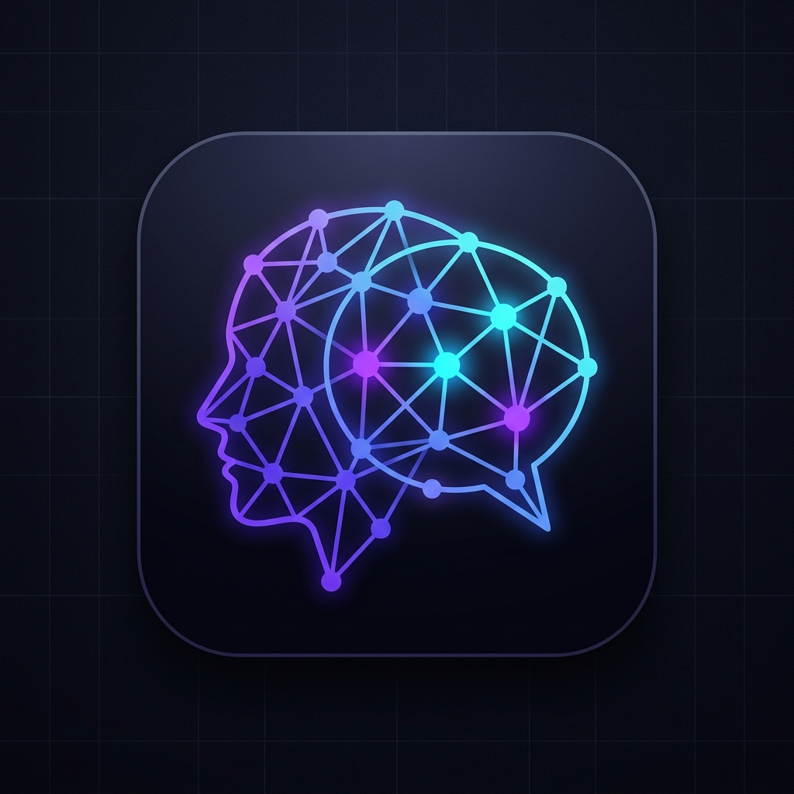

# ZenViva — AI Interview & Career Coach

<p align="center">
  
</p>

<p align="center">
  <strong>Master technical and behavioral interviews with real-time AI feedback and weighted rubric scoring.</strong>
</p>

<p align="center">
  
  
  
  
  
  
</p>

---

## 🌟 Overview

**ZenViva** is an intelligent AI interview preparation and career coaching platform. Powered by Google's latest **Gemini 3.8 Flash** model, ZenViva simulates real-world hiring rounds tailored specifically to your target job role, experience level, and custom technical skillset.

Unlike generic flashcards or static quiz banks, ZenViva actively listens, dynamically formulates follow-up drill-down questions based on your previous replies, and objectively scores your answers using a strict **4-dimensional mathematical evaluation matrix**.

---

## ✨ Key Features

- **🎯 Role-Specific Adaptive Interviews**: Choose from presets (Python Developer, Full-Stack, Data Scientist, AI/ML Engineer, etc.) or input any custom role and skill combination.
- **⚖️ 4-Dimensional AI Evaluation Matrix**: Every answer is scored out of 10 based on an objective, weighted rubric:
  - **Technical Accuracy & Correctness (30%)** — Conceptual correctness and precision.
  - **Completeness & Depth (25%)** — Addressing all facets of the prompt.
  - **Communication Clarity & Structure (20%)** — STAR method, coherence, and progression.
  - **Practical Application & Trade-offs (25%)** — Real-world edge cases and scalability.
- **⚡ Contextual Follow-up Drilldowns**: The AI coach detects areas in your responses that need clarification and generates intelligent follow-up questions to simulate true conversational rounds.
- **🎙️ Web Speech Voice Recognition & TTS**: Speak your answers aloud with live browser speech-to-text and listen to questions read back to you.
- **📄 Resume PDF Parsing**: Upload your resume (`.pdf`, `.docx`, `.txt`) to generate personalized questions tailored directly to your past projects and experience.
- **📊 Interactive Analytics Dashboard**: Track historical performance, average scores, and topic strengths through interactive Chart.js visualizations.
- **🚀 1-Click Desktop Launcher**: Launch the local server and web client directly with a single click using the included Windows batch launcher.

---

## 🏗️ Project Architecture

```
ZenViva/
│
├── app.py                      # Flask application routes and API endpoints
├── requirements.txt            # Python dependencies
├── .env.example                # Sample environment configuration
├── .gitignore                  # Git ignore rules (protects .env and database)
├── README.md                   # Project documentation
├── start_app.bat               # 1-click Windows launcher
├── ZenViva.url                 # Web browser shortcut
│
├── ai/
│   ├── question_generator.py   # Gemini prompt engine for context-aware questions
│   └── evaluator.py            # 4-dimensional AI Evaluation Matrix rubric engine
│
├── database/
│   └── database.py             # SQLite persistence, schemas, and migrations
│
├── utils/
│   └── resume_parser.py         # PyPDF2 extraction logic for uploaded resumes
│
├── templates/                  # Jinja2 frontend templates
│   ├── index.html              # Interview setup & role selection
│   ├── interview.html          # Live interview simulator & rubric feedback
│   ├── dashboard.html          # Analytics history & score trends
│   └── result.html             # Detailed performance report with print/PDF export
│
├── static/
│   ├── css/
│   │   └── style.css           # Modern dark glassmorphism design system
│   ├── js/
│   │   └── script.js           # Voice input, timer, and reactive UI interactions
│   └── img/
│       └── logo.png            # Application logo and favicon
│
├── data/                       # Local SQLite storage (interviews.db)
└── uploads/                    # Temporary secure storage for resume parsing
```

---

## 🚀 Quick Start Guide

### 1. Clone the Repository
```bash
git clone https://github.com/ashubhandari22/ZenViva.git
cd ZenViva
```

### 2. Set Up a Virtual Environment (Recommended)
```bash
# On Windows:
python -m venv venv
venv\Scripts\activate

# On macOS/Linux:
python3 -m venv venv
source venv/bin/activate
```

### 3. Install Dependencies
```bash
pip install -r requirements.txt
```

### 4. Configure Environment Variables
Create a `.env` file in the root directory (you can copy `.env.example`):
```bash
copy .env.example .env
```

Open `.env` and add your [Google AI Studio](https://aistudio.google.com/) Gemini API key:
```env
GEMINI_API_KEY=your_actual_gemini_api_key_here
FLASK_SECRET_KEY=zenviva_super_secret_session_key
```

### 5. Launch the Application
Run via Python:
```bash
python app.py
```
*Or on Windows, simply double-click `start_app.bat`.*

Open your browser and navigate to: **[http://127.0.0.1:5000](http://127.0.0.1:5000)**

---

## 📊 Evaluation Matrix Formula

$$\text{Final Score} = (0.30 \times \text{Accuracy}) + (0.25 \times \text{Depth}) + (0.20 \times \text{Clarity}) + (0.25 \times \text{Trade-offs})$$

Every submission breaks down into individual sub-scores, highlighting exact strengths and actionable areas for improvement alongside high-caliber model answers.

---

## 🛡️ License

This project is licensed under the **MIT License** — feel free to use and adapt it for your own interview preparation and learning.

---

## 👤 Author

Developed by **[Ashutosh Bhandari](https://github.com/ashubhandari22)**  
Delhi, India 📍
